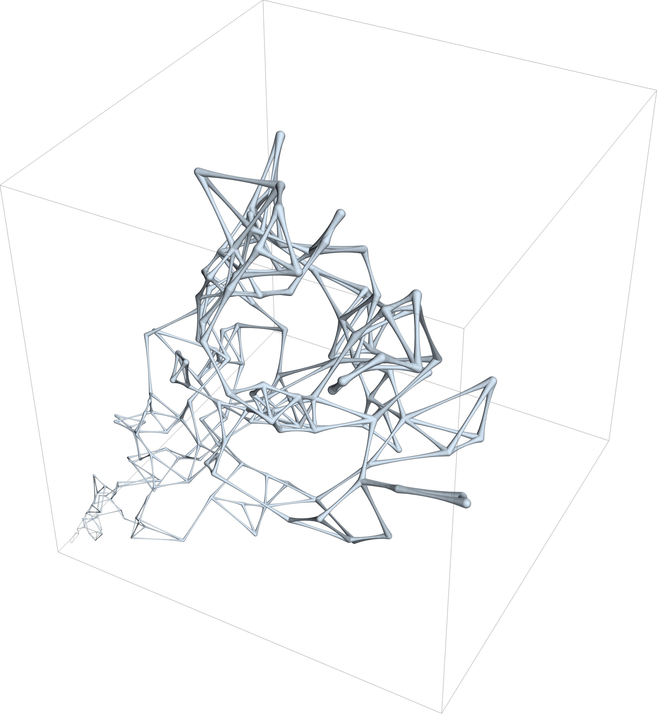

# Galaxy Art Project
This is a Mathematica project to display our neighboring galaxies from Sloan Digital Sky Survey data in a creative way. Only data from a single octant and within a defined cone was used, such that we are positioned at the vertex of the data. The entire distribution is shown growing in size with increasing distance from the origin to remind us of the expanding universe. Edges are drawn between nearest nodes to remind us that this a complex gravitationally-connected system.

